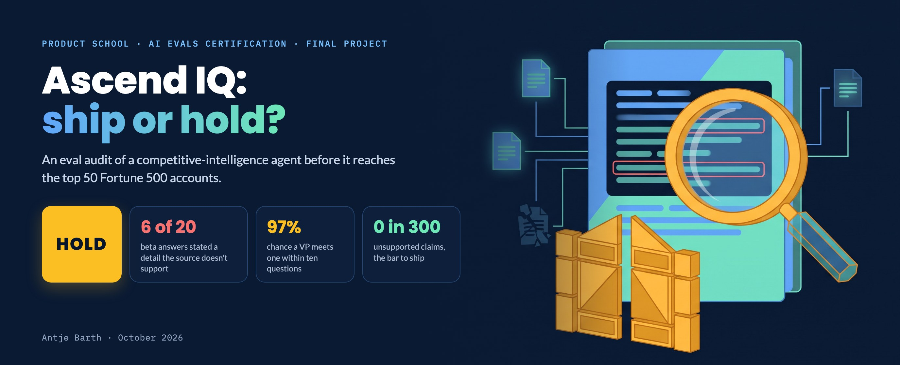

# AI Evals: Final Project

[](06-culture/lab-2-final-pitch.html)

> My final project for Product School's **AI Evals** certification. One evaluation system for a real LLM feature, from strategy, through failure discovery and an automated eval suite, to the gates and governance that let it ship safely.

---

## Deliverables at a glance

| Module | Artifact | Status | File |
|---|---|---|---|
| M1 | **Evaluation Strategy Canvas** | ☑ | `01-evaluation-strategy/strategy-canvas.md` |
| M1 | **Eval harness proof** (links + screenshots) | ☑ | `01-evaluation-strategy/eval-harness-proof.md` |
| M2 | **Failure audit log** | ☑ | `02-failure-discovery/audit-log.md` |
| M2 | **Failure Taxonomy** | ☑ | `02-failure-discovery/failure-taxonomy.md` |
| M3 | **Runnable eval suite** (results) | ☑ | `03-eval-suites/lab-1-eval-suite.md` |
| M3 | **Trajectory eval** (scorecard) | ☑ | `03-eval-suites/lab-1b-trajectory.md` |
| M3 | **Judge calibration** (κ) | ☑ | `03-eval-suites/lab-judge-calibration.md` |
| M3 | **Eval Spec** (5-part spec + audience messages) | ☑ | `03-eval-suites/lab-2-eval-spec.md` |
| M4 | **Eval gate map** (severity × placement) | ☑ | `04-eval-gates/lab-1-gate-map.md` |
| M4 | **CI gate policy** (PR #218 replay) | ☑ | `04-eval-gates/lab-ci-gate-policy.md` |
| M4 | **Launch strategy** (release criteria + CI policy + mitigation) | ☑ | `04-eval-gates/lab-2-launch-strategy.md` |
| M5 | **Coverage matrix** | ☑ | `05-scale/lab-1-coverage-matrix.md` |
| M5 | **Eval budget** | ☑ | `05-scale/lab-2-budget-crisis.md` |
| M6 | **Ship / Hold memo** | ☑ | `06-culture/lab-1-ship-hold-memo.md` |
| M6 | **Final pitch deck** (generated HTML) | ☑ | `06-culture/lab-2-final-pitch.html` |

## The feature in one sentence

Ascend IQ is a customer-facing AI agent inside Ascend Analytics, a B2B market-intelligence platform. It answers plain-language competitive questions for VP-level strategists at Fortune 500 accounts who pay $50k+ a year for verified data. A wrong answer in front of one of the top 50 accounts costs the renewal and the relationship, so the question this repo answers is whether it clears that bar: ship, or hold.

---

## Repo structure

```
ai-evals/
├── README.md                         ← this dashboard
├── 01-evaluation-strategy/           ← Module 1
│   ├── strategy-canvas.md            from the Strategy Canvas tool
│   └── eval-harness-proof.md         from the first eval lab
├── 02-failure-discovery/             ← Module 2
│   ├── audit-log.md                  scored audit of real outputs
│   └── failure-taxonomy.md           prioritized failure modes
├── 03-eval-suites/                   ← Module 3
│   ├── lab-1-eval-suite.md           runnable 3-layer suite results
│   ├── lab-1b-trajectory.md          trajectory scorecard
│   ├── lab-judge-calibration.md      judge calibration (κ)
│   └── lab-2-eval-spec.md            5-part eval spec + audience messages
├── 04-eval-gates/                    ← Module 4
│   ├── lab-1-gate-map.md             severity × pipeline-placement grid
│   ├── lab-ci-gate-policy.md         CI gate demo (PR #218 replay)
│   └── lab-2-launch-strategy.md      release criteria + CI policy + mitigation
├── 05-scale/                         ← Module 5
│   ├── lab-1-coverage-matrix.md      coverage across product lines
│   └── lab-2-budget-crisis.md        eval budget + trade-offs
└── 06-culture/                       ← Module 6
    ├── lab-1-ship-hold-memo.md       ship/hold recommendation
    └── lab-2-final-pitch.html        generated pitch deck
```
